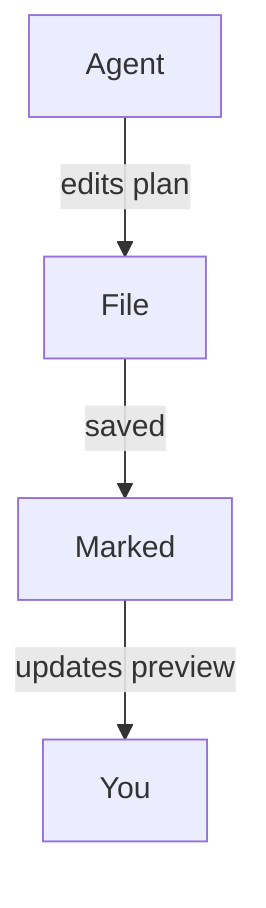

#
# <%= @title %>

Marked ist ein großartiger Begleiter für moderne „agentische Codierungs“-Workflows, bei denen KI-Tools Pläne generieren, Code umgestalten und die Dokumentation während der Arbeit ständig aktualisieren. Indem Sie Marked Ihre Projekt- oder Planungsordner überwachen lassen, erhalten Sie eine Live-, lesbare Ansicht dessen, was Ihre Coding-Agenten als Nächstes anfassen, ohne Ihren Editor oder Dateibaum durchsuchen zu müssen.

## Beobachten Sie Ihren Projekt- oder Planordner

Anstatt eine einzelne Datei zu öffnen, können Sie Marked auf einen gesamten Ordner verweisen, den Sie für Pläne, Notizen oder KI-generierte Dokumentation verwenden:

- Behalten Sie in Ihrem Projekt einen eigenen Ordner „Pläne“ oder „Notizen“.
- Konfigurieren Sie Ihren Programmieragenten (oder sich selbst), um dort Designdokumente, Aufgabenaufschlüsselungen und Statusnotizen zu speichern.
- Öffnen Sie diesen Ordner in Marked.

Sobald Marked einen Ordner überwacht, wird automatisch die **zuletzt geänderte Datei** angezeigt. Während Ihr Agent Markdown-Dateien erstellt oder aktualisiert – unabhängig davon, ob es sich um einen neuen Implementierungsplan oder ein aktualisiertes Fortschrittsprotokoll handelt – wechselt Marked zum neuen oder geänderten Dokument und aktualisiert die Vorschau sofort.

Dies funktioniert besonders gut mit Agententools wie Cursor, Claude und Copilot, die kontinuierlich Spezifikationen, Aufgabenlisten oder Architekturnotizen neu generieren, während Sie eine Funktion iterieren.

## Scrollen zur ersten Änderung

Wenn *Zum Bearbeiten scrollen* in den Einstellungen von Marked aktiviert ist, wird die Vorschau nicht einfach neu geladen, sondern **scrollt direkt zum ersten geänderten Bereich** der Datei, wenn sie aktualisiert wird.

Das bedeutet, dass Sie:

- Lassen Sie Ihren KI-Assistenten Abschnitte eines Plans oder Designdokuments neu schreiben.
- Sehen Sie zu, wie Marked die Datei neu lädt, sobald sie gespeichert ist.
- Landen Sie automatisch in der Nähe der ersten geänderten Zeilen, anstatt manuell nach den Änderungen zu suchen.

In Kombination mit der Ordnerüberwachung ist es so einfach, genau zu sehen, was Ihre Agenten mit Ihren Dokumenten machen, selbst wenn sie häufige, inkrementelle Änderungen vornehmen.

## Diagramme mit Mermaid.js

In Marked ist außerdem die **Mermaid.js-Unterstützung standardmäßig aktiviert**, sodass Sequenzdiagramme, Flussdiagramme und Architekturdiagramme, die Ihre Agenten mithilfe von Mermaid-Codeblöcken generieren, in der Vorschau sauber gerendert werden. Wenn Ihr KI-Assistent abgeschirmten Code ausgibt wie:

````

````

Marked wandelt es automatisch in ein gestaltetes, interaktives Diagramm um und bietet Ihnen eine visuelle Ansicht komplexer Arbeitsabläufe, Datenflüsse oder Systemdesigns, die von Tools wie Cursor, Claude, Copilot und anderen Agenten-Codierungsassistenten erstellt wurden.

## Beispiel-Workflows für die Agentencodierung

- **Cursor + Marked**: Behalten Sie einen Ordner `plans/` oder `notes/` in Ihrem Repository, in dem Cursor Schritt-für-Schritt-Implementierungspläne schreibt. Zeigen Sie mit Marked auf diesen Ordner, um immer den neuesten, sauber gerenderten Plan anzuzeigen, während Sie Änderungen im Editor akzeptieren und anwenden.

- **Claude + Marked**: Verwenden Sie Claude, um Designdokumente, ADRs und Refactoring-Pläne in einem freigegebenen Projektordner zu generieren. Marked öffnet automatisch die neueste Markdown-Ausgabe, sodass Sie sie wie eine lebende Spezifikation lesen und mit Anmerkungen versehen können.

- **Copilot und andere KI-Codierungsassistenten + Marked**: Unabhängig davon, ob Sie GitHub Copilot, Copilot Workspace, ChatGPT oder andere Agententools verwenden, die Markdown schreiben, erhalten Sie durch das Speichern ihrer Ausgabe in einem überwachten Ordner eine immer aktuelle Vorschau in hoher Qualität in Marked.

Durch die Kombination der Ordnerüberwachung mit *Zum Bearbeiten scrollen* verwandelt Marked KI-generierte Pläne und Notizen in ein schnelles, lesbares Kontrollzentrum für Ihre Codierungssitzungen – insbesondere, wenn Sie auf Agenten-Workflows und kontinuierliche Unterstützung durch Tools wie Cursor, Claude und Copilot zurückgreifen.

