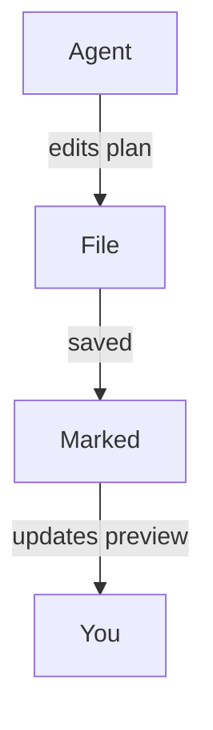

<!-- MT-DRAFT: machine translation; human review required -->

#
# <%= @title %>

Marked est un excellent compagnon pour les flux de travail modernes de « codage agent » dans lesquels les outils d'IA génèrent des plans, refactorisent le code et continuent de mettre à jour la documentation pendant que vous travaillez. En laissant Marked surveiller votre projet ou vos dossiers de planification, vous obtenez une vue en direct et lisible de tout ce que vos agents de codage touchent ensuite, sans avoir à parcourir votre éditeur ou votre arborescence de fichiers.

## Regarder votre dossier de projet ou de plan

Au lieu d'ouvrir un seul fichier, vous pouvez pointer Marqué vers un dossier entier que vous utilisez pour les plans, les notes de travail ou la documentation générée par l'IA :

- Conservez un dossier dédié « plans » ou « notes » dans votre projet.
- Configurez votre agent de codage (ou vous-même) pour y enregistrer les documents de conception, les répartitions des tâches et les notes d'état.
- Ouvrez ce dossier dans Marked.

Une fois que Marked surveille un dossier, il affichera automatiquement le **fichier le plus récemment modifié**. Lorsque votre agent crée ou met à jour des fichiers Markdown --- qu'il s'agisse d'un nouveau plan de mise en œuvre ou d'un journal de progression mis à jour --- Marked bascule vers le document nouveau ou modifié et actualise instantanément l'aperçu.

Cela fonctionne particulièrement bien avec les outils agents tels que Cursor, Claude et Copilot qui régénèrent en continu les spécifications, les listes de tâches ou les notes d'architecture pendant que vous parcourez une fonctionnalité.

## Faire défiler jusqu'au premier changement

Lorsque *Scroll to Edit* est activé dans les préférences de Marked, l'aperçu ne se contente pas de se recharger --- il **fait défiler directement jusqu'à la première zone modifiée** du fichier lors de sa mise à jour.

Cela signifie que vous pouvez :

- Laissez votre assistant IA réécrire des sections d'un plan ou d'un document de conception.
- Regardez Marked recharger le fichier dès qu'il est enregistré.
- Atterrissez automatiquement à proximité des premières lignes modifiées, au lieu de rechercher manuellement ce qui a changé.

Combiné à la surveillance des dossiers, cela permet de voir facilement exactement ce que vos agents font à vos documents, même lorsqu'ils effectuent des modifications fréquentes et incrémentielles.

## Diagrammes avec Mermaid.js

Marked a également **la prise en charge de Mermaid.js activée par défaut**, de sorte que les diagrammes de séquence, les organigrammes et les diagrammes d'architecture que vos agents génèrent à l'aide des blocs de code Mermaid s'afficheront proprement dans l'aperçu. Lorsque votre assistant IA génère du code clôturé comme :

````

````

Marked le transformera automatiquement en un diagramme stylisé et interactif, vous donnant une vue visuelle des flux de travail complexes, des flux de données ou des conceptions de systèmes créés par des outils tels que Cursor, Claude, Copilot et d'autres assistants de codage agent.

## Exemples de workflows de codage agent

- **Curseur + Marqué** : conservez un dossier `plans/` ou `notes/` dans votre dépôt où le curseur écrit les plans de mise en œuvre étape par étape. Pointez sur ce dossier pour toujours voir le dernier plan, rendu proprement, lorsque vous acceptez et appliquez les modifications dans l'éditeur.

- **Claude + Marked** : utilisez Claude pour générer des documents de conception, des ADR et des plans de refactoring dans un dossier de projet partagé. Marked ouvre automatiquement la dernière sortie Markdown afin que vous puissiez la lire et l'annoter comme une spécification vivante.

- **Copilot et autres assistants de codage IA + Marked** : que vous utilisiez GitHub Copilot, Copilot Workspace, ChatGPT ou d'autres outils agents qui écrivent Markdown, l'enregistrement de leur sortie dans un dossier surveillé vous offre un aperçu toujours à jour et de haute qualité dans Marked.

En combinant la surveillance des dossiers avec *Scroll to Edit*, Marked transforme les plans et notes générés par l'IA en un centre de contrôle rapide et lisible pour vos sessions de codage, en particulier lorsque vous vous appuyez sur des flux de travail agents et sur l'assistance continue d'outils tels que Cursor, Claude et Copilot.